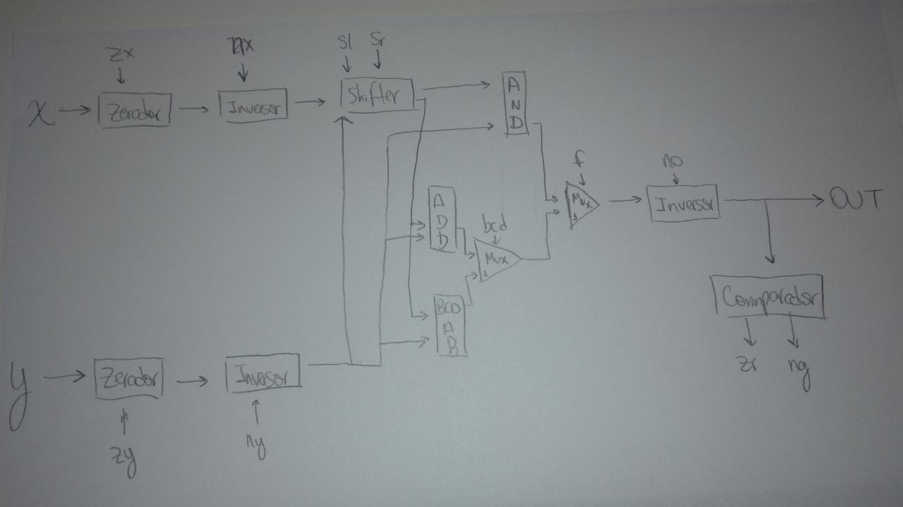

# Repositório para o Projeto de Bits e Processadores  

*Como requerido, os componentes das rúbricas B e A do Projeto C estão em uma branch separada: `componentesB-A`*  

## Integrantes do Grupo:
- Gustavo Lindenberg Pacheco
- João Lucas de Moraes Barros Cadorniga
- Marcelo Rabello Barranco 
- Pedro Antônio Silva
- Thomas Chiari Ciocchetti de Souza

## Link para o vídeo do Projeto B:
- <a href="https://www.youtube.com/shorts/Z4_pWcjIxNA">Acesse via YouTube</a>  
  
## Link para o vídeo do Projeto C:
- <a href="https://youtu.be/EGpIxk3uop0">Acesse via YouTube</a>

## Link para o vídeo do Projeto D:
- <a href="https://youtu.be/r2Bp7DpKYtE">Acesse via YouTube</a>

## Diagrama da ULA (new) da Rúbrica A:

